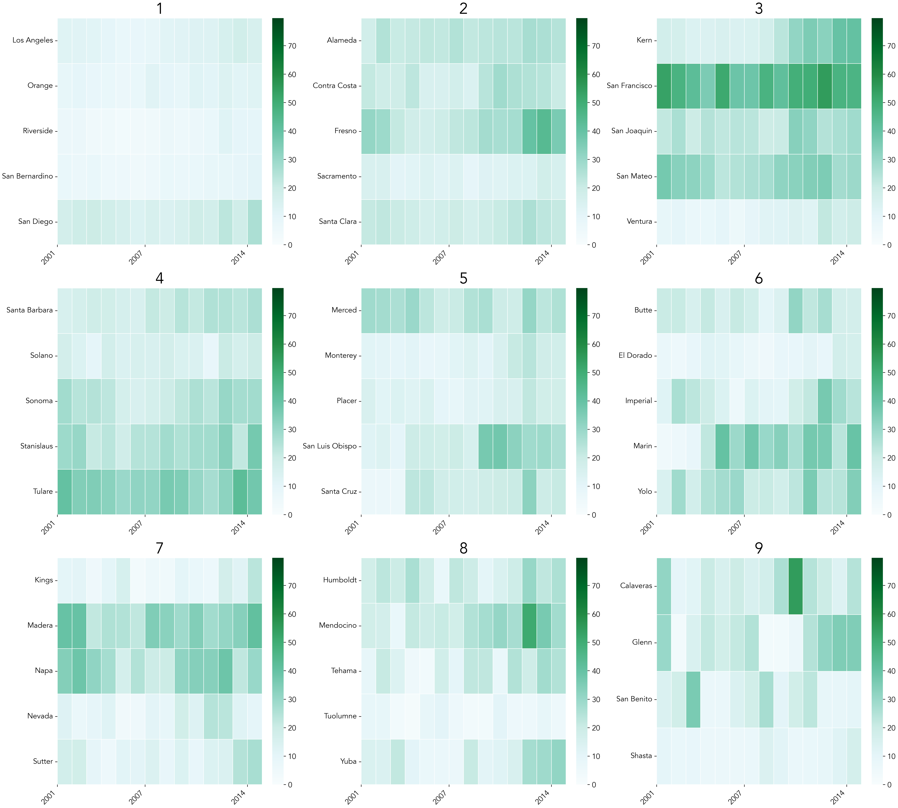

# Campylobacteriosis Prevalence in California

**Campylobacteriosis** prevalence across California from 2001 to 2014. The original content is sourced from the "California Open Data Portal" website. This dataset was pre-processed (i.e. augmented or filtered in some way) from a Kaggle user for public use. The purpose of this project was twofold - 

1) to successfully extract Campylobacteriosis prevalence data by coding with various python libraries 
2) to reveal superficial trends in Campylobacteriosis across Californian counties by population size, over time

Conclusion: Campylobacteriosis in California from 2001 - 2014 expectedly fluctuates by county over time. Coding heatmaps of prevalance rates is as a great way for local epidemiologists to begin an exploratory data analysis of preexisting datasets. 

Fig. 1. Campylobacteriosis Prevalence in California by County (2001 - 2014)
---

## Project Overview - Visualization for a Superficial Trend Analysis 

Campylobacteriosis is a enteric infection of public health interest (e.g. for food-borne illness prevention). The exploratory analysis of this dataset centered on creating concise Python code for heatmatps of the incidence rates and corresponding confidence intervals. These heatmaps may reveal superficial trends and disparities across county groups. This code can be replicated for another exploratory data analyses of this kind. 

---

## Steps (exlporatory Preprocessing and Analysis)

- **Grouped County Analysis**: Counties with no missing data were grouped based on population and visualized in 3x3 subplots for comparison.
- **Prevalence and Confidence Code**: Heat maps of prevalence rates were created by testing various python code in an exploratory analysis. Note, confidence intervals provide insights into the reliability of the reported rates!
- **Summary Statistics**: Descriptive tables summarizing population ranges, Prevalence rates, and confidence intervals for each county group.

---

## Data Source

The dataset originates from a preprocessed file (see citations below):
- **Disease**: Campylobacteriosis
- **Geography**: California counties
- **Metrics**: Prevalence rates, confidence intervals, and population sizes 
- **Timeframe**: 2001–2014

---

## Key Visualizations

1. **Grouped Subplots**: A 3x3 grid showing Campylobacter Prevalence rates for each county group.
2. **Confidence Intervals**: Highlighting variability and trends in disease reporting.
3. **Descriptive Statistics Table**: Overview of population and rate ranges for each group.

## Conclusions 

This code is useful for creating heatmaps - a great visual tool in an exploratory data analysis. 

The heatmaps alone may only reveal superficial trends. This project highlights the limitations of only using "rates, confidence intervals, year, and population size" for epidemiological analysis. For a statistical comparison we need more information like population values for standardization and case counts for recalculating confidence intervals. Still, code for these heatmaps will prove valuable for the exploratory data analysis in anyone's search for the right epidemiological project. Happy programming! 

## References 

Lash, Timothy L., et al., editors. Modern Epidemiology. 4th ed., Wolters Kluwer / Lippincott Williams & Wilkins, 2021.
The Devastator. (2021). California Infectious Disease Cases. Kaggle. https://www.kaggle.com/datasets/thedevastator/california-infectious-disease-cases 

